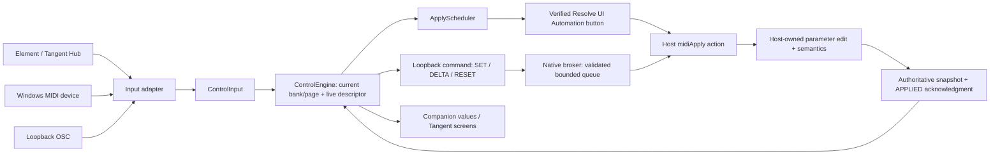

# Engineering handoff for AI agents and contributors

This document describes the **0.2.0-prototype working implementation, inspected on 8 October 2026**. It is a navigation and maintenance guide, not a claim that every host or controller has passed acceptance. Start with the current [build status](BUILD_STATUS.md), [setup](SETUP.md), [acceptance checklist](ACCEPTANCE.md), Git status and latest release. Those may contain newer evidence than this snapshot.

The project is a free Windows companion and separately identified community Spektrafilm OFX build. Its original hardware target is a full Tangent Element Kb/Tk/Bt/Mf set. Generic Windows MIDI ingress already exists, but arbitrary controller profiles, MIDI Learn, MIDI output feedback and controller-specific installation are **future work**. See [MIDI controller workplan](MIDI_CONTROLLER_WORKPLAN.md) before adding them.

## Start here

1. Read this document, `README.md`, `docs/BUILD_STATUS.md` and `MODIFICATIONS.md`.
2. Inspect local modifications before editing. Previous work may be uncommitted and shared with another agent. Do not reset, clean or overwrite it to get a convenient baseline.
3. For controller work, read `companion/Core/Mapping.cs`, the `MidiDecoder` portion of `companion/Core/Transports.cs`, `companion/Windows/MidiInput.cs`, and `MainForm.ReceiveInput`.
4. Read the host boundary in `plugin/src/SpektraMidiHost.inc` and targeting in `companion/Core/Wire.cs` even if you only intend to change MIDI mapping.
5. Decide which checks apply before using live ports or hardware. The full suite requires Resolve and the companion closed; the ordinary companion tests use separate test discovery ports.
6. Preserve the separate effect identity and explicit arm workflow. A controller feature normally needs no change to the OFX renderer or broker protocol.

All paths below are repository-relative unless they begin with an environment variable. File names and method names are better navigation anchors than line numbers, which move between commits.

## Product constraints to preserve

| Area | Required behavior |
|---|---|
| Coexistence | Regular Spektrafilm continues to load independently. Never install over its bundle or adopt its OFX identifier. |
| Intent | The user explicitly chooses an effect through its Arm MIDI button or the companion's Control this effect action. Connecting a device, launching the app, selecting a bank or receiving discovery must not arm an effect. |
| Host ownership | OFX parameter setters execute from a legal host action. MIDI, UDP workers, render callbacks and arbitrary timers must not call them. |
| Targeting | Commands carry the current session, instance and generation. Fresh complete state and exactly one fresh armed target are required. |
| Feedback | Actual host state wins over a predicted controller value. QUEUED is receipt; APPLIED is host execution. |
| Failure | Stale/ambiguous state disables control. Disconnect, Pause, target change and heartbeat loss clear/disarm rather than replay old motion. |
| Hardware scope | One physical input adapter is connected at a time. Do not connect native Tangent and an OSC/MIDI bridge to the same panel events. |
| Availability | The live descriptor controls availability, bounds, steps and choices. Static catalogue coverage does not authorize writes to missing, hidden, disabled or animated controls. |

### Separate plugin identity and user state

The native `spektrafilm_midi` target sets `SPEKTRAFILM_MIDI_CONTROL=1`; the regular target does not. Conditional integration is in `plugin/src/SpektraFilmPlugin.cpp`, and build targets/bundle resources are in `plugin/CMakeLists.txt`.

| Item | MIDI sibling |
|---|---|
| OFX identifier | `local.tangentmidi.spektrafilm` |
| Inspector/effect label | `Spektrafilm MIDI (Community Beta)` |
| Bundle | `spektrafilm_midi.ofx.bundle` |
| Windows defaults | `%APPDATA%/TangentMidi/Spektrafilm/v1/ofx-defaults-v1.spkdefaults` |
| Windows presets | `%APPDATA%/TangentMidi/Spektrafilm/v1/presets/` |
| Companion preferences | `%APPDATA%/TangentMidi/Spektrafilm/companion-v1.json` |
| Native Tangent user-map directory | `%APPDATA%/TangentMidi/Spektrafilm/TangentMaps/` |
| Clipboard format | `local.tangentmidi.spektrafilm.params.v1` |
| LUT/user folder name | `spektrafilm_midi`, in the host's appropriate LUT/export locations |

The installer uses the identity in `Contents/Resources/plugin_manifest.json` before replacing a recognized MIDI sibling. The regular baseline built for tests is not a distribution deployment target. Do not import installed-only official plugin assets into this public-source project.

## Architecture and the complete control path



The three input routes converge on `ControlInput`, then `ControlEngine`. Neither the input adapters nor the engine directly manipulate Resolve parameters. The engine emits a wire command and suggests host application. The native broker validates and queues it. A real Apply MIDI host action drains that queue and performs checked edits. Subsequent snapshots supply confirmed values and availability.

### Code map

| File | Main responsibility / useful anchors |
|---|---|
| `companion/Core/Mapping.cs` | MappingProfile schema, ControlInput, ControlEngine, bank/page selection, live fallback resolution, units/scaling, pickup, snapshots and supported actions. |
| `companion/Core/Wire.cs` | Versioned tab-separated protocol, escaping/numbers, Parameter and Target records, complete-snapshot InstanceRegistry. |
| `companion/Core/Transports.cs` | PluginConnection, OSC parser/listener, MidiDecoder, native Tangent codec/client/feedback. |
| `companion/Core/ApplyScheduler.cs` | Earliest dispatch deadline, two-second retry lifetime and protection for input received during a host invocation. |
| `companion/Windows/MidiInput.cs` | WinMM device enumeration/open/start/close and short-message callback. |
| `companion/Windows/MainForm.cs` | Controls/Advanced UI, settings, one-adapter lifecycle, raw input diagnostics, MIDI-note action resolution, explicit control action, automatic binding/routing orchestration. |
| `companion/Windows/SafeApplyBinding.cs` | Exact-marker UIA discovery, user-triggered visible-effect Arm, automatic/manual Apply binding and revalidation on invocation. |
| `companion/Windows/TangentApplicationRouting.cs` | Mapper Select Application UIA workflow, checked-state settling and ownership-aware restoration. |
| `companion/Windows/Program.cs` | Profile lookup, GUI single-instance mutex, second-launch focusing, self-test and headless diagnostics. |
| `plugin/src/SpektraMidiControl.h/.cpp` | Native broker, endpoint lifecycle, wire validation, queue, expiry, heartbeat and acknowledgments. |
| `plugin/src/SpektraMidiHost.inc` | Live parameter description/availability, status marker and legal host Apply transaction. |
| `plugin/src/SpektraFilmPlugin.cpp` | MIDI instance hooks/controls and shared `applyParameterSemantics`; upstream render/parameter implementation. |
| `profiles/tools/generate_profiles.py` | Reproducible catalogue, semantic maps, Tangent XML, fixed MIDI reference and coverage generation. |
| `companion.tests/Program.cs` | Core/transport/scheduler/loopback tests; no Resolve UI or physical controller. |
| `tests/native/HostHarness.cpp` | Minimal legal OFX host for targeting, lifecycle, parameter and transaction contracts. |
| `tests/end_to_end.py` | Actual C# headless OSC → native DLL queue → synthetic legal host action integration. |

## Native protocol and lifecycle

`Wire.Version` is 1. Commands are UTF-8, tab-separated, with percent-encoded string fields and invariant round-trip finite numbers:

```text
OPERATION<TAB>1<TAB>session<TAB>instance<TAB>generation[<TAB>arguments...]
```

Parameter commands are `DELTA`, `SET` and `RESET`, with parameter ID and component. `SNAPSHOT`, `DISARM` and `APPLY` have management roles. **There is no network ARM command.** A network APPLY request returns `PENDING_HOST_ACTION`; it does not commit the queue.

| Endpoint/timing | Current implementation |
|---|---|
| Companion discovery | Exclusive UDP `127.0.0.1:55051` by default |
| Broker listener | Loopback UDP on a dynamically allocated port; advertisement and source port must agree |
| Native companion-port override | `TANGENT_MIDI_COMPANION_PORT`, used for controlled tests; not an ordinary user setting |
| Advertisement cadence | About one second |
| Companion heartbeat | A targeted SNAPSHOT request about every 700 ms for fresh armed instances |
| Companion target freshness | LastSeen less than four seconds |
| Native contact timeout | Three seconds, then disarm and discard queue |
| Native input expiry | Two seconds per queued command |
| Native queue limit | 2,048 commands; overflow disarms and clears the target |
| Native command packet limit | 8,192 bytes |
| Companion snapshot assembly | Matching revision/count, no duplicate component rows; completes within five seconds |

The broker accepts loopback packets only from its configured companion discovery port. `InstanceRegistry` verifies loopback origin and advertised endpoint source, and never forwards session tokens to a different advertised service. This is local targeting and stale-state protection, not a remotely exposed authenticated service. Preserve loopback binding.

A broker session token, per-instance ID and generation identify a target. Arm invalidates prior queued work, advances the generation and disarms another armed instance in the same broker. Disarm, unregister and timeout invalidate ownership. A copied/recreated instance receives a new endpoint; cached tokens must not be reused. The companion additionally refuses zero or multiple fresh armed instances.

Advertisements and snapshots are distinct. `STATE_BEGIN`, `PARAM` rows and `STATE_END` must form one complete same-revision snapshot before replacement of authoritative state. A new generation starts without inherited values. An incomplete new revision must not be treated as permission to send parameters based on stale state.

## Legal host edits, semantics and UI Automation

`instanceChanged` handles `midiArm`, `midiDisarm` and `midiApply`. `applyMidiCommands` in `SpektraMidiHost.inc` takes non-expired commands, opens one OFX edit group for the batch, and re-reads descriptor state before each semantic edit. It rejects unavailable parameters and linked animated dependencies, clamps to descriptor bounds, preserves continuous doubles and rounds discrete values. It calls the shared `applyParameterSemantics`, then refreshes conditional visibility. `MidiSnapshotAfterAction` publishes authoritative state when the host action returns, including on early return paths.

This protects behavior such as stock/calibration ownership, HDR preset dependencies and printer gang/group rules. Do not add a parallel setter path that skips those semantics. Animation/keyframe support is intentionally conservative: keyed/animating parameters and affected animated dependencies are refused. Calibration actions, preset/LUT management and other pushbutton semantics are not general numeric mappings.

An empty host callback can return `APPLY: APPLIED 0`. That verifies callback reachability only. A nonempty acknowledgment and changed authoritative value are needed to demonstrate an actual controller edit. A stopped playhead or successful render does not itself apply pending edits.

`SafeApplyBinding` searches Resolve-owned accessible buttons. Normal automatic binding requires one visible/enabled Apply MIDI button, one fresh complete armed target and the exact nearby `MIDI target: <full instance ID>` marker. The stored target identity includes generation; the stored UIA runtime ID identifies the specific button. Searches run off the main UI where appropriate; results are checked against current state before installation. Each invocation checks again for freshness, uniqueness, identity and marker ownership. Do not weaken a failed exact-marker match into a name-only match.

**Control this effect** is the sole companion action that may invoke Arm. It runs only in response to that user click, matches a fresh discovered instance to the visible marker, finds its nearby Arm button, rechecks both buttons/process/runtime IDs and honors cancellation before invocation. Automatic setup must never call it on startup or reconnect. Users can always explicitly arm in the effect instead.

Automatic Apply requires foreground Resolve. Explicit **Apply now** may invoke a verified bound button with Resolve in the background because the user clicked a commit action. Bindings are transient, not saved. Changed or ambiguous inspectors must invalidate them. There is no coordinate-click, global-key or private Resolve API fallback.

`ApplyScheduler` starts a roughly 65 ms deadline and preserves the earliest deadline during continuous input; it does not wait for a quiet period. Retry expiry follows the latest input's two-second lifetime. `RequestVersion` and `ClearIfUnchanged` keep reentrant input received during a UIA host invocation for the next dispatch. Do not replace this with a debounce that indefinitely postpones continuous turns, or clear newer work when an older callback completes.

## Mapping, sensitivity and displays

`profiles/mappings.json` is the runtime semantic profile. Version 1 currently requires exactly **24 axes**, with distinct indices 0–23. Banks contain pages of slot definitions, optional steps, fallbacks, compound terms and reset semantics. The fixed logical surface mirrors Element:

| Logical axis | Physical allocation |
|---|---|
| 0–11 | Kb knobs 1–12 |
| 12–20 | Tk ball 1 X/Y/ring, then ball 2 and ball 3 |
| 21–23 | Mf ball X/Y and ring |

The static catalogue audits 140 editable parameters / 160 components against the pinned public descriptor source. The tested live native build supplied 155 rows because build-conditional parameters differ. `ControlEngine.AddCatalogBank` generates All available parameters from actual available descriptors. Catalogue coverage is not a substitute for live availability.

For a continuous scalar, relative motion is:

```text
delta = raw increment × (slot step or live parameter step) × relative speed × Fine factor
Fine factor = 0.1 while held, otherwise 1
```

Relative speed defaults to 1 and accepts finite values 0.01–4. It applies to continuous doubles, including compound double terms. It does not change choices/integers/booleans, absolute positions or resets. Discrete motion uses accumulated fractional remainders before whole steps. Four Tangent A modifiers and MIDI Fine notes can overlap; releasing one must not cancel another held modifier.

The broker's published Step is an integration policy derived in `midiReadParameters`, not a controller-resolution guarantee: continuous finite spans below 10,000 use span/400 clamped to 0.0001–1, otherwise a default-magnitude fallback; exposure/push overrides use 0.05 and conditional RGB printer points use 0.1. A semantic slot can override it. Essentials currently uses 0.025 for Film/Print Exposure and 0.01 for Film/Print Push. Test the selected bank's actual slot, not an assumed universal exposure increment.

Absolute input is normalized to 0–1, mapped to live bounds and uses pickup/crossing with a 0.015 normalized tolerance. Bank/page/target changes clear pickup state. An external authoritative host change requires pickup again unless it matches the expected own absolute request. Compound printer axes currently require relative input. Opponent printer movement scales channels together at a boundary and refuses gang/group; do not clamp each component independently and distort the direction.

Early native Tangent profiles had an excessive generic range and step 1. The corrected controls use range −100 to 100, step 0.01. Step 1 also rounded panel numeric feedback; it did not mean OFX exposure only accepted whole stops. Keep these separate when diagnosing sensitivity: physical/raw increment, semantic unit step, global speed, Fine, and display formatting.

Actual values/choices return through authoritative snapshots. `AxisDisplay` carries label, text, numeric value, availability and default state. The Windows grid remains Element-labelled in this implementation. A future generic controller UI must stop claiming that an eight-knob MIDI box is a Kb/Tk/Mf set.

## Current MIDI capabilities and gaps

`MidiInput` uses WinMM and retains its callback delegate for the device lifetime. Exceptions must never unwind into WinMM. It currently handles short-message input; SysEx buffer/output handling is absent.

`MidiDecoder` has **one global encoding** and channel filter per input instance. It hardcodes CC 0–23 as logical axes. Notes 0–23 reset their corresponding axes on press; other notes become `midi-note:<number>` actions. `MainForm.ReceiveInput` resolves those against `MappingProfile.Buttons.MidiNote`. Normal engine-only/headless use does not automatically provide that Windows note-resolution step.

| Encoding | Current decode |
|---|---|
| RelativeBinaryOffset | value − 64; 64 is zero |
| RelativeTwosComplement | values below 64 unchanged; otherwise value − 128 |
| RelativeSignMagnitude | values below 64 positive; otherwise −(value − 64); 64 is zero |
| Absolute7Bit | value / 127 |
| Absolute14Bit | CC 0–23 MSB plus CC 32–55 LSB on the same channel; combined / 16383 |

14-bit pairs may arrive in either order. Once both halves have been seen, later updates combine with the remembered other half; there is no pair-age timeout or atomic-pair guarantee. `Reset` clears pairs. Note-on velocity zero counts as release, and explicit note-off releases buttons. There is no generic CC-button mapping, Program Change mapping, pitch-bend mapping, NRPN/RPN interpreter, MIDI Learn, per-axis encoding or MIDI output feedback.

**`profiles/midi/default-midi.json` is a generated reference contract, not a runtime-loaded configurable device profile.** Editing its CC numbers alone will not change `MidiDecoder`. Likewise, arbitrary `midiCC` metadata in generated mappings is not a replacement for the decoder's hardcoded CC convention. This is a central starting point for the controller workplan.

## Tangent-specific integration

The native route is TCP loopback port 64246 by default. `TangentConnection` waits for Hub initiation, sends application definition `0x81` with system/user map directories, then allows feedback. It tracks socket connection, definition readiness, configured panel entries, actually connected panel reports and real input separately. A connected TCP socket does not prove the panel application is selected.

Preserve handshake/display ordering, including re-initiation: definition must precede feedback, cached mode must reset, and the current unchanged mode must be resent. Native feedback uses mode `0x85`, label `0xA2`, value/default `0x82`, and custom bank/arm text `0x86`. Labels/text are bounded to 32 characters in the implementation. GUI feedback is throttled; confirmed values remain authoritative.

Mapper Auto-select normally selects Resolve's usual mapping when Resolve gains focus. That caused the original focus-dependent failure. `TangentApplicationRouting` uses the installed Mapper's accessible Select Application menu, exact application names and checked states. It waits up to two seconds for Qt menu state to settle. The tested Qt provider can retain multiple checked application flags after selection; the narrow fallback accepts a fresh main-window title only when its exact `Tangent Mapper - <checked application> - <nonempty suffix>` prefix corroborates exactly one of those checked full menu names. It never selects an unchecked name or uses a loose substring. Auto-select's checked state is separately verified. Preserve these constraints when changing the workaround.

Routing does not rewrite Hub XML or executable associations. Ownership includes Mapper process ID/start time, previous routing and the expected routing this session selected. Restoration only occurs if the process and current settings still match that ownership. User changes and restarts are left alone; restoration can fail and must offer manual instructions.

The whole set changes application ownership; split-panel Resolve/Spektrafilm ownership is not established. The reserved A+B native/mappable gesture is not an application-selection shortcut. Five transport roles and Resolve undo/redo routes are intentionally unavailable. Do not turn them into guessed global keystrokes.

## Build, tests and distribution

The normal Windows source build uses PowerShell 7, VS 2022 C++ tools, CMake, Vulkan SDK with `VULKAN_SDK`, .NET 9 SDK, Git and Python 3.12. `Build.ps1 -Bootstrap` prepares isolated Python dependencies and the pinned OpenFX checkout; inspect an existing dependency checkout rather than silently replacing it.

```powershell
./Build.ps1 -Bootstrap
./Test.ps1
./Package.ps1 -Version 0.2.0-prototype -Zip
```

Close Resolve and the companion before the full `Test.ps1`: the host/integration tests use discovery 55051 and OSC 9000, and installer contracts require Resolve closed. Do not kill a live grading session to satisfy a test prerequisite. Run unaffected checks and arrange a suitable session for the full suite.

For a companion-only change, the focused checks are:

```powershell
$env:DOTNET_CLI_HOME=Join-Path (Get-Location) '.build/dotnet-home'
$env:DOTNET_CLI_TELEMETRY_OPTOUT='1'
$env:DOTNET_GENERATE_ASPNET_CERTIFICATE='false'
dotnet restore companion/Windows/SpektrafilmMidi.csproj --configfile companion/NuGet.Config
dotnet build companion/Windows/SpektrafilmMidi.csproj -c Release --no-restore
dotnet restore companion.tests/Spektrafilm.Control.Tests.csproj --configfile companion/NuGet.Config
dotnet run --project companion.tests/Spektrafilm.Control.Tests.csproj -c Release --no-restore
./.build/python/Scripts/python.exe -m unittest discover -s profiles/tests -v
./.build/python/Scripts/python.exe profiles/tools/generate_profiles.py --check
```

The companion runner uses test discovery ports 55053/55054 and an ephemeral Tangent listener. It does not require closing the real host. Building over a currently running source executable can cause file-lock copy failures; stop/relaunch the correct app through its normal lifecycle or publish into an isolated output, without discarding its session state. A sandbox may need ordinary build-tool access to installed Windows SDK registry/files; do not treat permission denial as proof of a source error.

| Output | Location/purpose |
|---|---|
| Native sibling bundle | `.build/plugin/spektrafilm_midi.ofx.bundle/` |
| Regular test baseline | `.build/plugin/spektrafilm.ofx.bundle/` |
| Native host harness | `.build/host-tests/Release/HostHarness.exe` |
| Source companion | `companion/Windows/bin/Release/net9.0-windows/SpektrafilmMidi.exe` |
| Test logs | `.build/validation/` |
| Self-contained packaging artifacts | `.build/package-artifacts/` |
| Binary/source distribution | `dist/Spektrafilm-MIDI-<version>/` and `-source/`, with ZIPs when requested |

Profile generation uses the unchanged `profiles/reference/SpektraFilmPlugin.cpp` pinned to upstream `86476afc5b077de77e2278e3658d1ba9309892a1`; do not point it at the modified sibling and accidentally export connection-management controls as grading controls. Change the generator, regenerate and use `--check`; do not patch generated XML/JSON alone. The OpenFX dependency is pinned to `e40728885390ec16276d11e00025de9b4282060c`.

`Package.ps1` defaults to the current prototype version and publishes self-contained win-x64 using isolated artifacts. It restores Microsoft runtime packs from NuGet, includes the actual runtime licences/notices in `licenses/dotnet`, and records included frameworks plus file hashes in `build-manifest.json`. Source/binary packages retain GPL notices. Build/package do not install the effect or alter Mapper routing.

Users extract the entire ZIP. **Install MIDI Effect.cmd** is the explicit one-time elevated installation, checks Resolve closed and calls the identity/path-safe `Install.ps1 -Apply`. **Start Spektrafilm MIDI.cmd** launches with bundled profiles; **Launch Companion.cmd** is compatible. Existing 0.1.x users can keep the native OFX binary for the 0.2.0 companion update. The install/uninstall scripts default to preview unless Apply is supplied directly. No virtual MIDI driver is installed.

`--self-test` is a small profile/frame smoke check, not the complete test suite. `--headless` uses discovery and OSC but has no automatic Resolve host-action pump. The GUI uses the named local mutex `SpektrafilmMidi.Gui.v1` to prevent duplicate interactive instances. A second launch focuses the existing companion; it does not replace it with the new binary. Quit the previous GUI before testing an updated release. Diagnostic modes do not own that mutex but still use ports; do not run competing headless discovery listeners.

## Evidence and acceptance matrix

Use [BUILD_STATUS.md](BUILD_STATUS.md) for current executed results. Prior testing recorded a real protocol-14 Hub handshake, four connected Element panels, three discovered Resolve instances/155 component rows, exact-marker binding and a short physical run with 178 input events and nonempty Apply acknowledgments. It drove exposure/push values to bounds, which motivated sensitivity changes. Those results do not certify the new startup/routing flow or another MIDI controller.

The subsequent **0.2.0 live GUI check on installed Resolve Studio 21/Mapper** confirmed startup connected four panels and automatically switched from Resolve's application to Spektrafilm MIDI. A user-triggered Control this effect invoked the real Arm button; automatic Apply binding reached Ready and displayed fractional actual host values. Pause restored Resolve's mapping and disconnected; Resume reselected Spektrafilm without automatic arming. Normal exit restored Resolve, duplicate launch kept one companion, and Advanced wrapping/scrolling was inspected. This verifies that short GUI flow on the installed versions; it is not a fresh full physical-knob, sensitivity or generic MIDI acceptance run.

| Area | Automated coverage / required live evidence |
|---|---|
| Identity/coexistence | Native host and workspace installer contracts; still verify regular+sibling nodes, save/reopen and regular-bundle hashes in Resolve. |
| Queue/target safety | Broker/host/core tests cover stale generations, expiry, timeout, ambiguity and snapshot completeness; live delete/rearm/project-change/disconnect tests remain necessary. |
| Host dispatch | Synthetic integration proves legal callback path; real Apply acknowledgments plus inspector/image/returned-value change prove a live edit. QUEUED or APPLIED 0 alone is insufficient. |
| Relative control | Unit tests cover units, full magnitudes, all-axis bursts, Fine and continuous speed; record slow/fast turns both ways on actual hardware and check usable sensitivity. |
| Absolute/14-bit | Parser/pickup tests; actual device direction, pair order, mode switching, external mouse edits, bank changes and reconnect must be tested. |
| Buttons/modifiers | Logical maps and action tests; test each button, note-off/velocity-zero, simultaneous Fine holds and unplug while held. |
| Panels/screens | Logical coverage and feedback packets; inspect all physical labels/choices/numeric values, availability, long names and reconnect states. |
| Mapper routing | Installed-version startup/selection, explicit Arm/automatic binding, Pause/Resume and normal-exit restoration passed a short live GUI check. Broader versions, user override, interrupted reconnect, unsupported controls and physical feel still need acceptance. |
| Resolve project behavior | Test redraw/cache, undo/redo, save/reopen, exports and normal rendering. One Apply batch is one edit group; whole-gesture undo is not implemented. |
| Generic MIDI | Current parser/engine tests do not establish a given WinMM device, driver or firmware. Each controller needs captured fixtures and a recorded physical acceptance run. |
| Packaging | Verify manifest hashes, included runtime/licences, fresh extraction/start and installer refusal/sibling isolation. A successful source build alone does not validate a downloadable ZIP. |

## Known scope limits and common failed fixes

- Public source is Spektrafilm Windows 0.1.9, older than the installed official release used during initial research. Lens/Motion and licensed Academy printer-density tables are absent. C/M/Y filtered-enlarger fallback is intentional; do not invent missing controls or copy licensed installed data.
- The default full-frame Vulkan path is shipped. The upstream experimental tiled float16 path has a dither parity difference; controller work does not justify changing rendering tolerances or enabling that path.
- Transport, Resolve undo/redo command routes, whole-gesture undo and automatic offline-export disarming are not implemented. Pause/disarm before export.
- Startup/connect/Resume must not restore an old arm token. Automatic binding to a freshly explicitly armed target is different from automatic arming.
- Do not “fix” QUEUED by extending queue expiry, treating an ACK as a value change, changing OFX state from a worker, or adding a network APPLY setter path.
- Do not “fix” focus routing by associating the companion executable with the same name and assuming Resolve will keep it selected; Mapper Auto-select must be handled separately.
- Do not “fix” sensitivity by rounding doubles or discarding raw encoder magnitude. Verify decoding, semantic step and speed independently.
- Do not claim a custom device profile exists because a JSON reference file exists. Runtime loading and physical routing need implementation and tests.

When handing work to another agent, include the exact commit/dirty state, files changed, commands actually run, test outputs, package hash/version, app versions and remaining physical checks. Mark proposals as proposals. Keep the stable host/target boundaries intact while adding controller features.
