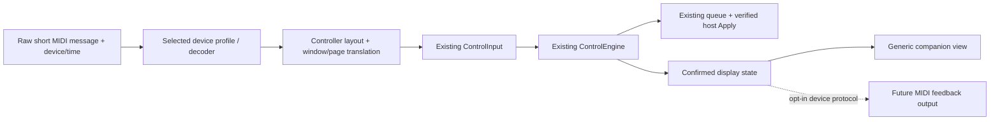

# Workplan: support other MIDI controllers

This is an implementation roadmap, **not a list of features already shipped**. The inspected 0.2.0 prototype has WinMM MIDI input, five encoding modes, fixed 24-axis CC/note conventions, a shared semantic engine and safe host Apply. It does not have arbitrary controller profiles, MIDI Learn, per-control encoding, generic controller layouts, MIDI output feedback or verified support for named MIDI products.

The goal is to let a user choose their existing controller, turn its actual controls, choose the visible MIDI effect once and grade with predictable sensitivity. Keep regular Spektrafilm separate, retain explicit target arming and reuse the current host-owned queue/Apply path. Most of this work belongs in the companion, not in the OFX renderer or broker.

Read [AGENT_HANDOFF.md](AGENT_HANDOFF.md) first. Use the current [build status](BUILD_STATUS.md) as the verification baseline.

## Existing foundation and missing pieces

| Area | Already implemented | Work needed for arbitrary controllers |
|---|---|---|
| Device input | WinMM enumeration, one selected short-message input, saved display name | Ambiguity handling, stable-enough selection, hotplug/reconnect and raw diagnostic capture |
| Axes | CC 0–23 → logical axes 0–23 | Configurable CC/channel/physical-control bindings and mixed encodings |
| Relative values | Binary offset, two's complement, sign/magnitude | Per-binding choice, measured direction/magnitude/acceleration, no guessed mode |
| Absolute values | 7-bit and fixed paired 14-bit CC; shared soft takeover | Configurable pairs, timing policy, binding-state resets and real-device tests |
| Buttons | Notes 0–23 reset; other notes resolved through semantic profile buttons in MainForm | Arbitrary note/CC buttons, press/release behavior, per-controller actions and Fine aggregation |
| Layout | 24-axis Element semantic banks/pages | Fewer/more physical controls, accessible paging and generic labels without losing parameter reachability |
| Settings | One global encoding/channel, route/device name/bank/speed | Versioned device profile selection, migration and per-device preferences |
| Displays | Native Tangent feedback | Optional declared LED/ring/display feedback using actual controller protocol |
| Host link | Explicit Arm, fresh target checks, verified Apply, expiry | Preserve existing behavior; no controller-specific host setters |

Two files are easy to confuse:

- `profiles/mappings.json` **is loaded** by MappingProfile and defines semantic Spektrafilm banks/actions for 24 logical axes.
- `profiles/midi/default-midi.json` is generated reference documentation. **It is not loaded as a configurable MIDI device map.** MidiDecoder currently hardcodes its CC/note convention.

Editing the latter alone will not make a controller with CC 16–23 control logical knobs 0–7. Notes 0–23 are intercepted as resets before the existing action lookup. A new device router must operate before those legacy assumptions.

## Recommended architecture

Separate the hardware's message layout from the effect's parameter layout:



Keep decoding and routing testable in the platform-independent Core project. Keep WinMM handles/callbacks and UI in Windows. Preserve the native Tangent route and its 24-axis contract while the generic MIDI route grows independently.

For the first usable implementation, retain the engine's **24 logical slots** and let smaller devices access them through controller windows. For example, eight physical knobs can address slots 0–7, 8–15 and 16–23 within the current semantic page. A controller-window action and an existing semantic page action are different; the UI must show both clearly. Short final windows have inactive slots, not recycled hidden controls.

This avoids immediately changing every Tangent generator, mode ID and fixed-axis test. Add a deliberate engine/router API to clear pickup/remainder/held state when a controller window or binding changes. Do not rely on stale absolute latches from a previously visited window. A later independent phase can introduce variable-size semantic layouts if real controller use makes the window model inadequate.

### Proposed profile model

Introduce a new versioned device-profile model and loader, with a proposed location such as `profiles/controllers/`. These paths/types do **not** exist yet. Do not overload the Tangent semantic MappingProfile with hardware-specific bytes.

Minimum profile fields should cover:

- Stable profile ID, display name, schema version, authors/provenance and supported device firmware/mode.
- Input identification hints; they are hints, not authorization to choose an ambiguous device silently.
- Axis bindings: message type, channel, number/pair, encoding, physical label, logical slot/window role, inversion and an optional measured input multiplier.
- Button bindings: note/CC number, channel, press/release thresholds or values, hold/toggle/momentary behavior and action name.
- Physical layout: control count/order, labels and window/page navigation actions.
- Optional feedback capabilities and output-port requirements, disabled unless implemented and selected.

Illustrative **future** schema fragment; the present release cannot load it:

```json
{
  "schemaVersion": 1,
  "id": "example-eight-relative",
  "displayName": "Example eight encoder layout",
  "axes": [
    {
      "physicalId": "encoder-1",
      "message": "cc",
      "channel": 1,
      "number": 16,
      "encoding": "RelativeTwosComplement",
      "slot": 0,
      "inputScale": 1.0
    }
  ],
  "buttons": [
    {
      "physicalId": "fine",
      "message": "note",
      "channel": 1,
      "number": 48,
      "action": "fine",
      "behavior": "hold"
    }
  ],
  "feedback": { "enabled": false }
}
```

Validate unknown versions, nonfinite/out-of-range multipliers, invalid channels/numbers, duplicate physical IDs, unreachable slots/actions and overlapping bindings. Axis/button CC overlap must be rejected unless the schema has an explicit unambiguous selector. Unknown/unbound messages must be ignored; do not pass them through a permissive legacy fallback after selecting a custom profile. Provide a built-in **Legacy 24-axis** profile that reproduces today's conventions exactly.

## Stage 0 — measure one real controller

Pick the first controller from hardware the tester actually owns. Do not purchase or promise support for a model from memory. Obtain the manufacturer's current MIDI implementation and record exact model, firmware, operating mode, USB/driver path and Windows version. Different encoder modes on the same product may emit incompatible values.

Create a short-message capture/monitor path before assigning live edits. It should show device, timestamp, status/type, channel, data bytes and decoded interpretation without touching the OFX engine. For Learn/probing, explicitly disarm and suppress all parameter/control actions until capture ends. A hidden live grade must not move while the user identifies a knob.

Capture:

1. Each knob/fader's slow positive and negative movement, endpoint behavior and accelerated turns.
2. Every press/release, encoder press, shifted layer and Fine candidate.
3. Actual absolute endpoints and paired 14-bit order if supported.
4. USB disconnect/reconnect, duplicate port names and another application holding the port.
5. Startup traffic, bank-change messages and any feedback echo behavior.

Deliver a device protocol note and compact anonymized byte fixtures. Mark controls whose protocol is still unknown; do not guess their encoding. Keep these captures separate from screenshots or project material unrelated to controller messages.

**Exit criteria:** a hardware inventory and fixtures explain every control included in the first profile; no probing caused parameter writes.

## Stage 1 — raw MIDI and configurable routing

Starting files: `companion/Windows/MidiInput.cs`, `companion/Core/Transports.cs`, `companion/Core/Mapping.cs`, `companion/Windows/MainForm.cs` and `companion.tests/Program.cs`.

1. Expose a typed raw short-message record before fixed decoding. Include channel/type/data and ordering; keep the WinMM callback delegate alive and catch exceptions at the callback boundary.
2. Add the versioned device profile/validator in Core and a router that produces existing ControlInput values.
3. Move fixed CC/note behavior into the Legacy profile or a compatibility decoder behind it. Do not silently alter existing Tangent/OSC behavior.
4. Move generic MIDI-note action resolution out of MainForm-only assumptions so Core/headless tests can exercise a whole MIDI profile path.
5. Decode per binding. One device must be able to combine relative encoders, absolute faders and buttons without one global Encoding changing them all.
6. Instantiate/clear decoder state per selected device/profile session. Switching routes or profiles must disarm, clear pending Apply and dispose the previous input before opening another.

Tests should demonstrate non-default CC/note routing, channel filtering, ignored unrelated traffic, duplicate-binding rejection, press/release routing and exact Legacy compatibility. Include buttons using CC messages and notes below 24, which currently collide with fixed axes/resets.

**Exit criteria:** fixtures for the first controller yield the intended ControlInput sequence without Windows UI, a live plugin or hardcoded controller branches in ControlEngine.

## Stage 2 — correct relative, absolute and button behavior

### Relative encoders

Keep signed magnitude intact. Binary offset 65 and two's-complement 1 can both mean +1, while other values differ drastically. Sign/magnitude 65 means −1 in the current decoder. Do not infer the encoding from one message or compensate for a wrong sign/mode using an arbitrary speed reduction.

Implement declared inversion and an input multiplier at the device layer if measurements require them. Keep that separate from semantic units and the user's global Knob speed. Preserve accelerated input counts; do not truncate all turns to ±1. Avoid a second acceleration curve until the device's own behavior has been measured.

Retain continuous fractional units and existing discrete remainders. Test both directions, zero/no-op values, maximum raw magnitude, long sustained turns, Fine, multiple simultaneous controls and boundary behavior. An increase in input rate must not exceed the native bounded queue without a deliberate measured dispatch/coalescing strategy. Do not merge ordered semantic SET/RESET/mode changes blindly.

### Absolute faders and knobs

Use the existing ControlEngine pickup behavior rather than jumping to hardware position on selection. Test entering pickup from both directions, crossing, near tolerance, endpoint values, mouse edits, preset loads, target changes and window/page changes. Clear latches when a physical control is remapped even if the OFX generation is unchanged. Feedback must follow confirmed state, not make the engine believe an output value came from physical input.

For configurable 14-bit CC, validate distinct MSB/LSB numbers and same-channel pairing. Current decoder tests accept either order, but remembered halves persist after their first arrival. Choose and document a pair-age/update policy suitable for the measured device; test stale halves, intermittent LSBs, resets, reconnect and interleaved axes/channels. Pitch bend is also 14-bit data but is a separate message type; adding it is optional and requires its own mapping/tests. Do not call fixed paired-CC support general 14-bit protocol support.

### Buttons, reset and Fine

Distinguish press from release, note-on velocity zero from press, and momentary versus hardware-latching behavior. CC buttons need explicit threshold/edge semantics so a release cannot create a second action. A mapped toggle should have one well-defined edge; a held Fine control needs both edges.

Track held modifiers by physical binding identity. Releasing one of two held Fine buttons must leave Fine active; unplugging/rebinding/pausing must clear every hold. A reset maps to InputKind.Reset and the live descriptor default; it is not a guessed SET 0. Compound printer reset semantics must remain intact. Unsupported transport/undo roles remain visibly unavailable.

**Exit criteria:** the selected profile's decoded fixtures pass through a complete fresh target state and produce correct commands/units, with no accidental button releases, jumps or stuck Fine state.

## Stage 3 — controller layouts and useful UI

Starting files: MappingProfile/ControlEngine in `Mapping.cs`, `MainForm.cs` and the new device-layout/router code.

- Introduce physical-control labels and a generic display model. Keep Element Kb/Tk/Mf names for Element; show the selected MIDI device's actual knob/fader/button names elsewhere.
- For the initial 24-slot window model, show controller window, semantic bank and semantic page. Make all available parameters reachable even on an eight-control device, including short final windows.
- Provide a small first-controller layout: exposure/print exposure/push and common feature controls, bank/window navigation, Fine and reset. Prefer usable assignments to trying to emulate every Element button on a small box.
- Make unsupported/missing controls visibly inactive. Preserve live fallbacks and All available parameters. Do not expose disabled/internal management parameters merely to fill a page.
- Add explicit profile and input-port selection under Advanced, with a clear summary on Controls. Save profile ID and settings atomically/versioned; migrate existing preferences to Legacy without restoring arm ownership.
- Distinguish reconnecting an input from selecting an effect. Pause/disconnect disarms; reconnect must still require an explicit control action. Tangent Mapper selection/restoration belongs only to the native Tangent route.

WinMM numeric port IDs can change and current input names are truncated to the API's display field. Do not persist an ordinal as a durable USB identity. Use available name/manufacturer/product hints, and require selection when more than one candidate matches. Test a missing device and same-name duplicates. Add MIDI-specific reconnect/refresh deliberately; the current five-second retry loop is Tangent-specific.

**Exit criteria:** a new user can select the tested profile/port, explicitly choose the effect and reach every advertised control with clear status. Restart, unplug and ambiguous ports cannot route to the wrong device/target.

## Stage 4 — first physical controller acceptance

Do this before adding many named presets or saying “works with any MIDI controller.” Use a disposable Resolve project, a stationary playhead initially, the exact extracted package and recorded device mode.

| Test | Required observation |
|---|---|
| First connection | Intended input/profile selected, wrong/duplicate devices refused or explicitly chosen, startup traffic makes no edit. |
| Target | Control this effect or host Arm is explicit; wrong/unarmed/hidden/ambiguous/stale targets receive no edit. |
| Relative movement | Every assigned axis moves the intended parameter both ways with useful slow and fast feel, fractions and net magnitude preserved. |
| Absolute pickup | No jump before crossing; external edits, bank/window changes and reconnect require pickup again. |
| Buttons | Press/release, CC buttons, velocity-zero, reset and simultaneous Fine behave correctly; no stuck holds after unplug. |
| Host application | Nonempty APPLIED acknowledgment, inspector/image and confirmed state agree; a queued ACK alone does not pass. |
| Focus | Resolve foreground with visible MIDI controls commits; switching away obeys two-second expiry and causes no stale replay on return. |
| Session lifecycle | Pause/exit/device loss clears control; Resume/reconnect needs explicit effect choice. Selected profile/bank/speed preferences persist without arm tokens. |
| Resolve behavior | Normal undo/redo, save/reopen, cache redraw and exported frames work within documented limitations. |
| Coexistence | Regular Spektrafilm bundle/state and native Tangent workflow remain independent. |

Record controller→accepted-state latency separately from accepted-state→image/display latency. Grain/spatial effects and stock changes may have different rendering cost. A screenshot of a changing companion prediction is not acceptance.

**Exit criteria:** a named device/firmware/mode has reproducible captured fixtures and a physical acceptance record. Support claims name that tested configuration and list remaining limits.

## Stage 5 — profile editor / MIDI Learn

This is optional after the first hand-authored profile works. A learner cannot reliably infer relative versus absolute mode or release semantics from arbitrary motion alone.

1. Enter an explicit Learn mode that disarms live control and suppresses engine dispatch.
2. Ask the user to select a physical control and semantic role, then capture its actual message(s).
3. Show detected message type/channel/number and ask for the encoder mode when ambiguous. Offer a direction/magnitude preview that does not edit the effect.
4. Capture both button edges and both halves of paired values where applicable.
5. Validate collisions and completeness before saving a versioned user profile in a separate user-data folder.
6. Exit Learn, clear all parser/pickup/held state and require explicit effect choice before returning to grading.

Allow export/import for reviewable profiles, with schema/size/field validation and no executable commands or arbitrary filesystem paths. Keep generated bundled profiles separate from user edits. Add tests for cancellation, malformed imports, duplicate IDs and migration; do not overwrite a valued working user profile silently.

## Stage 6 — optional feedback, only for declared protocols

Conventional MIDI output is **not implemented in the companion**. Tangent dynamic displays use a separate native protocol; generic MIDI does not inherit them.

Add a Windows output adapter only when a tested device needs it and its manufacturer documents LEDs, rings, motor faders or screens. The existing optional Python OSC-to-MIDI bridge is an ingress experiment, not a generic companion feedback system.

- Select output explicitly or from an unambiguous tested profile hint. No broadcast to every MIDI output.
- Encode only declared supported messages. Do not guess SysEx commands, device modes or motor behavior.
- Send confirmed authoritative values and meaningful bank/availability state. Re-sync after external changes, target switch and reconnect.
- Bound rate and queue length, deduplicate unchanged values and prevent output→input echo loops. Do not discard genuine user input to suppress a guessed echo.
- Keep device/output callbacks away from OFX setters. Pause/disarm/output disconnect must have declared behavior.
- Treat motorized controls and long SysEx messages as separate implementation/acceptance work, including memory/buffer lifetimes and device-specific behavior.

Use byte-level output fixtures, a fake output sink, loopback/echo tests and actual device verification. Device feedback remains optional; input-only controllers must remain useful.

## Later extensions, not MVP promises

- Per-controller variable-size semantic layouts if 24-slot windows are awkward.
- Additional documented relative conventions, pitch bend, Program Change, NRPN/RPN or SysEx only when demanded by real hardware. NRPN/RPN data-entry CCs can collide with the legacy axis convention, so a declared profile must filter/interpret them explicitly.
- Controller-local layers, displays and motor faders after feedback infrastructure and acceptance.
- Multiple simultaneous physical controllers only with deliberate ownership/deduplication, combined modifier and pickup design. The current one-input rule remains until then.
- Cross-platform MIDI/host dispatch requires new OS adapters and host validation. This Windows/UIA implementation does not establish macOS/Linux support.
- MIDI 2.0/UMP is a separate transport/protocol project, not a switch on the current WinMM short-message decoder.
- Resolve transport or whole-gesture undo should be independent host-integration work; do not slip guessed shortcuts into a controller profile.

## Validation and release gates

For Core/Windows changes, build the Windows companion and run `companion.tests`. Add meaningful behavioral cases rather than tests that merely repeat a profile's serialized fields. Re-run Python profile/generation tests when shared mappings or the generator change. Keep the Tangent handshake/re-initiation and all-axis burst tests passing.

Run the cross-language/native host suite when commands, availability, queue behavior or host semantics change. The full `Test.ps1` uses real default integration ports and expects Resolve closed; read the handoff before launching it in a live workstation session. GPU tests are warranted when rendering/native integration changes, not merely because a controller label changed.

Before publishing a device-support release:

1. Record exact commit, test outputs and the device acceptance record.
2. Build the self-contained Windows ZIP and matching source with the updated version.
3. Verify all manifest hashes, runtime notices, profile inclusion and fresh-extraction launch.
4. Confirm the previous GUI has exited before launching the new executable; the single-instance mutex otherwise focuses the old build.
5. Verify the one-time installer still refuses open Resolve and only targets the MIDI sibling. Do not reinstall an unchanged native binary unnecessarily.
6. Write release notes distinguishing tested configurations, input-only support, optional feedback and pending features.

## First implementation slice for the next agent

Start with **one configurable relative-encoder controller, input only**:

1. Add the raw MIDI record and a safe capture mode.
2. Write a validated device-profile model and Legacy compatibility profile.
3. Route non-default CCs and arbitrary note/CC buttons into existing ControlInput, with per-binding encoding.
4. Add fixture tests for both directions, full magnitudes, ignored messages, Fine releases and resets.
5. Add profile/port selection and generic physical labels without changing the native Tangent contract.
6. Add controller windows if the first device has fewer than 24 controls; clear pickup/held state on remap.
7. Perform the physical acceptance table and package a documented input-only prototype.

Do not begin with MIDI output, a large list of untested vendor presets or changes to the OFX worker. The existing semantic and host-Apply boundary is the reusable foundation; make hardware routing configurable and prove one real controller end to end first.
